# Veritas: ZK Developer & Cryptographic Research Grant Protocol 🎓


## Level 4 release evidence — review pending

[Open the hosted application](https://credential-folio.vercel.app) · [Setup](SETUP.md) · [Usage](USAGE.md) · [Proposal](PROPOSAL.md) · [Tests](TESTING.md)

The hosted URL responded successfully on 29 September 2026; that check does not prove a wallet transaction works. The recorded contract coordinates are in [deployment.json](deployment.json). Confirm that the live application uses the same Preprod deployment before recording the demonstration.

- Local tests and production build passed. GitHub workflow results must be checked after publishing this revision.
- Desktop and mobile captures below cover every page. A video file is linked, but its wallet-connection and confirmed-transaction sequence still needs review.
- **Outstanding: public product X profile URL.** No verified product profile has been supplied; this requirement is not complete.
- Commit history exceeds 15 entries. Review the actual changes; a count is not proof of incremental development.

[Official Rise In program requirements](https://www.risein.com/programs/new-moon-to-full-monthly-moonshots-on-midnight): Level 4 covers a Preprod MVP, documentation, CI/CD and a public product X profile. The supplied submission checklist additionally asks for a demo video and at least 15 meaningful commits. Automated test calls must not be presented as independent users.


## Desktop and mobile walkthrough

Fresh captures of this build at 1440 × 1000 and 390 × 844. Wallet disconnected; no credentials entered. These images document the interface, not transaction finality.

<details>
<summary>View every page at both screen sizes</summary>

| Page | Desktop | Mobile |
| --- | --- | --- |
| home | 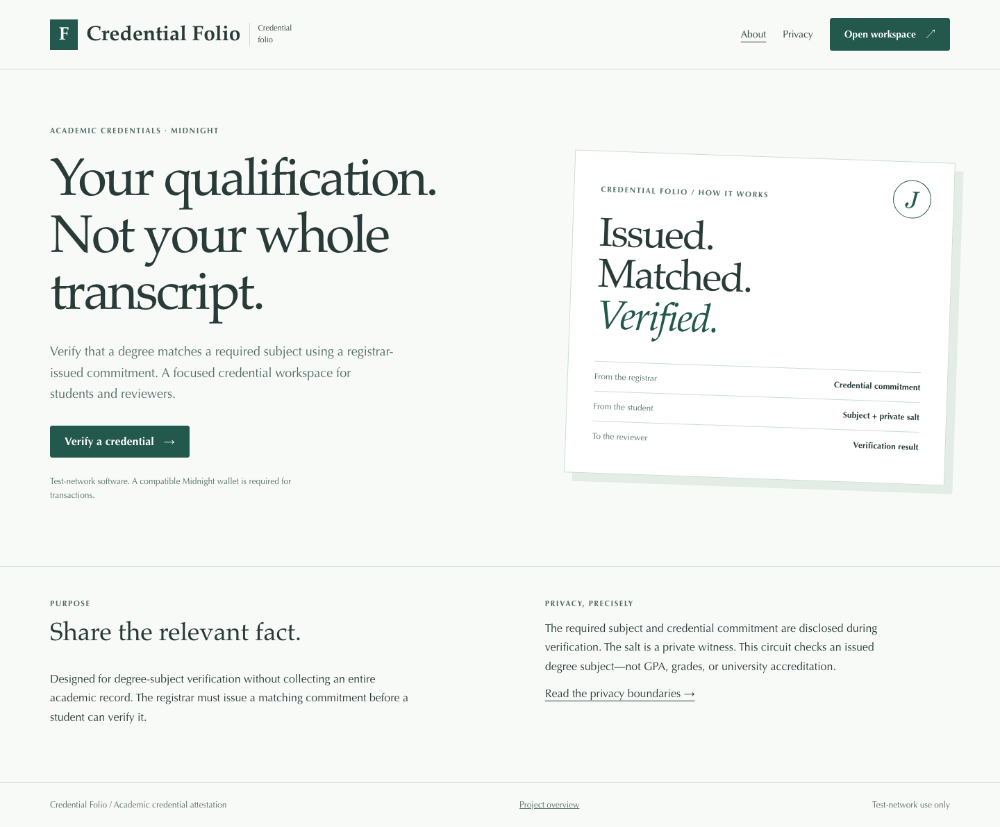 | 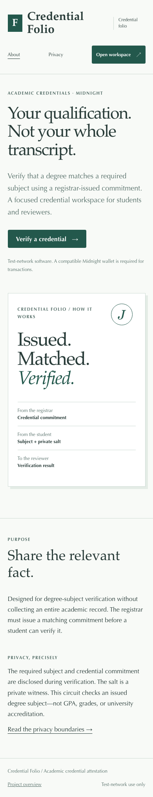 |
| privacy | 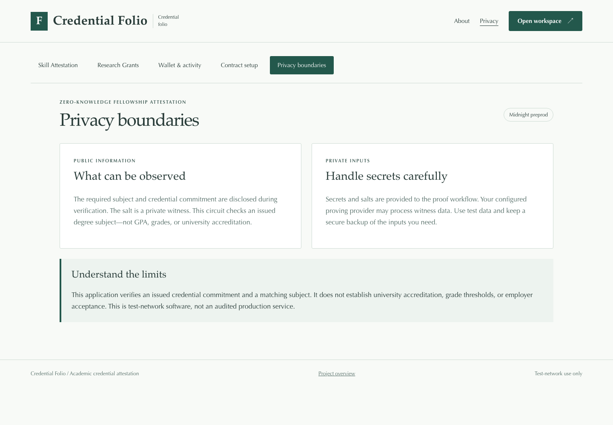 | 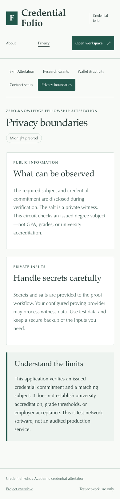 |
| dashboard | 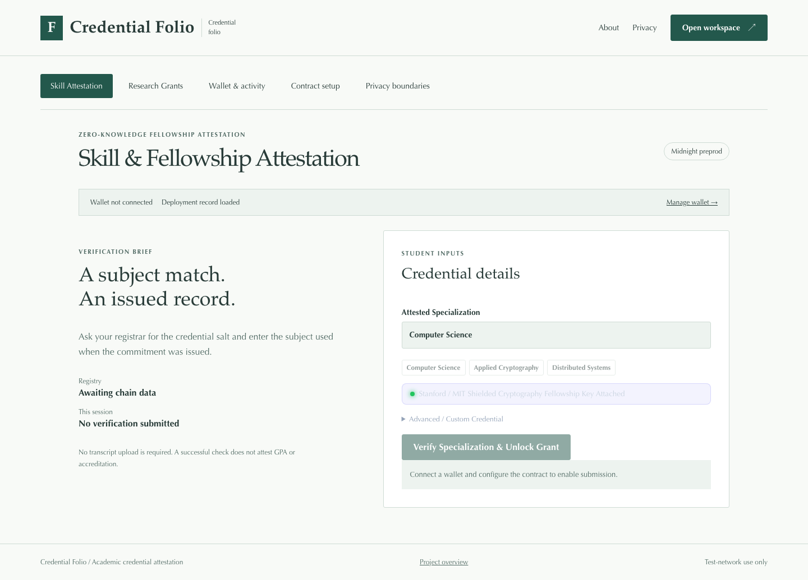 | 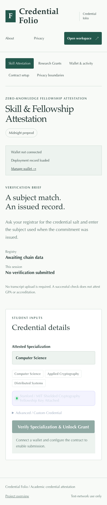 |
| grants | 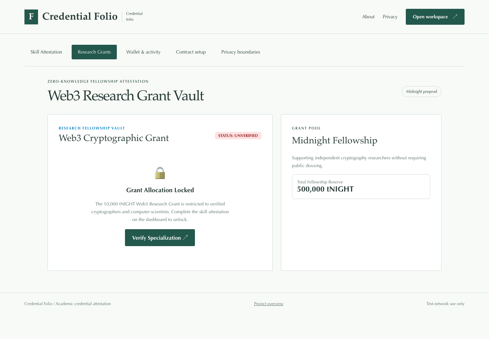 | 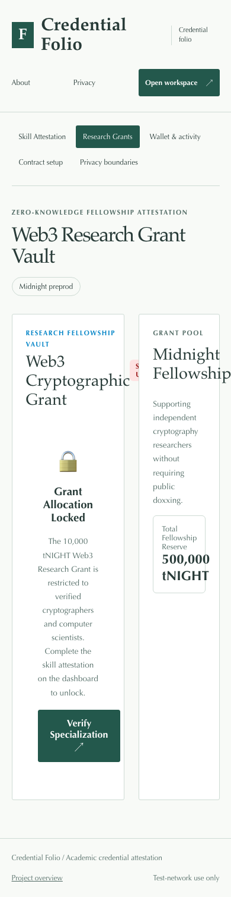 |
| walletHub | 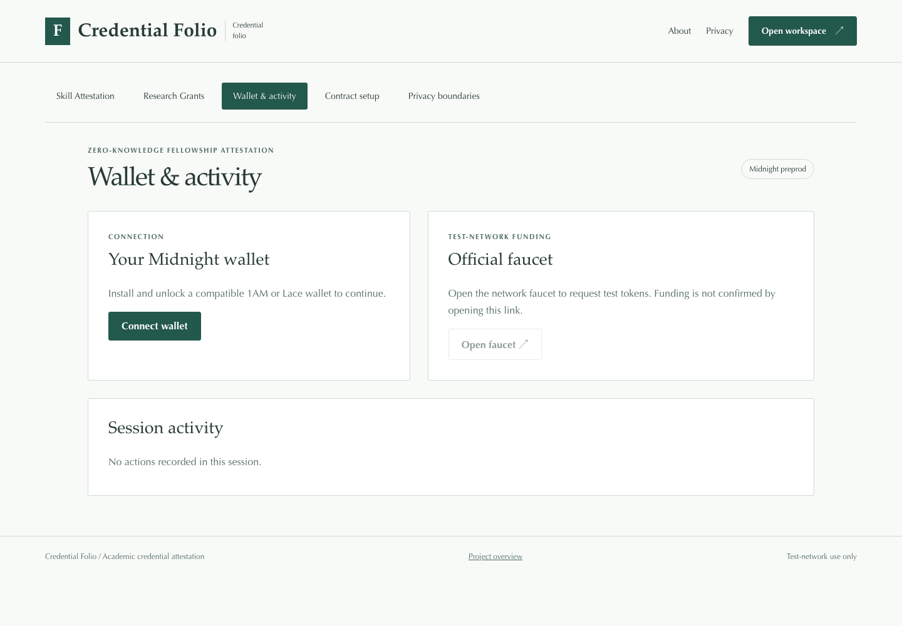 | 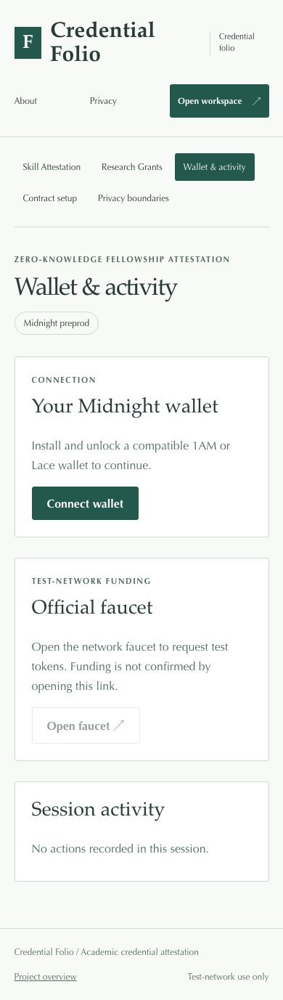 |
| deployer | 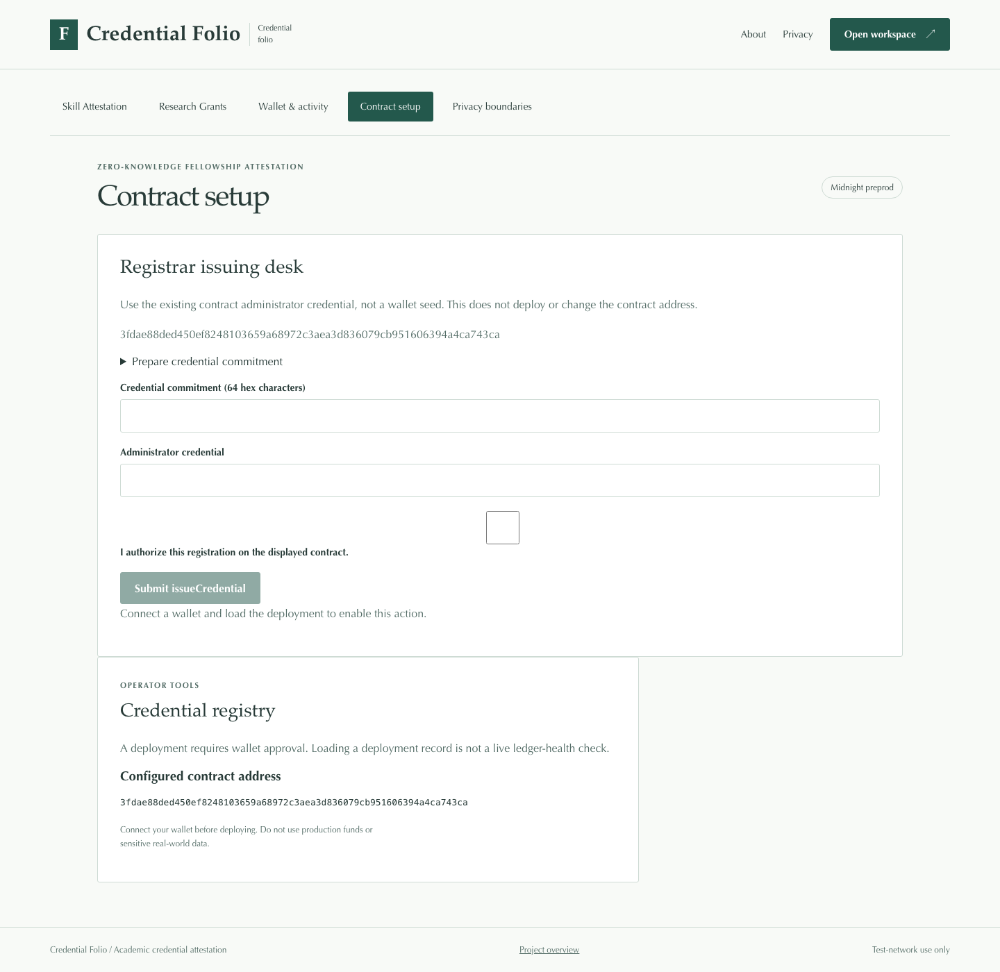 | 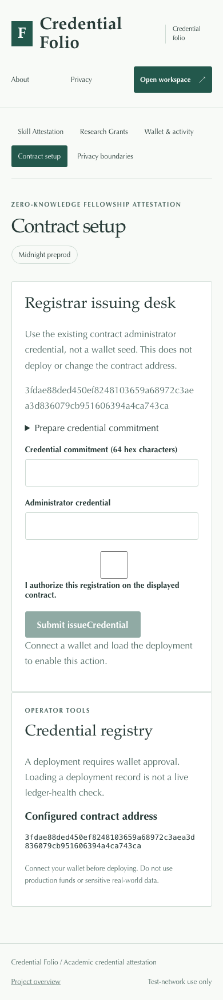 |

</details>

Capture details: [manifest](screenshots/capture-manifest.json). Recorded walkthrough: [demo video](demo.webm).
### Rise In — Midnight Journey to Mastery (Level 4 Capstone Submission)

[](https://midnight.network)
[](https://docs.midnight.network)
[](https://risein.com)
[](https://github.com/JanhaveePhadnis/academic-credential-attestation/actions/workflows/frontend-ci.yml)
[](https://github.com/JanhaveePhadnis/academic-credential-attestation/actions/workflows/contract-ci.yml)

**Veritas** is a privacy-preserving academic attestation and research fellowship protocol built on the **Midnight Network**. Researchers and developers prove that they hold accredited qualifications (such as `Computer Science`, `Applied Cryptography`, or `Distributed Systems`) from verified institutions without revealing their transcripts, GPA, student IDs, or names. Upon verified ZK attestation, candidates unlock access to a **10,000 tNIGHT Research Fellowship Grant Vault**.

---

## 🎬 Product Demo Video

- 🌐 **Watch Online:** [Stream on Google Drive ↗](https://drive.google.com/file/d/1rl1urj_zurCpibJB7A9cArWw7THAGZ_e/view?usp=sharing)
- 📁 **Local Video File:** [`demo.webm`](./demo.webm)

<video src="./demo.webm" controls="controls" width="100%"></video>

---

## 📋 Rise In Level 4 Capstone Submission Evidence

| Requirement | Evidence / Implementation Details |
| :--- | :--- |
| **Public Source Repository** | [JanhaveePhadnis/academic-credential-attestation](https://github.com/JanhaveePhadnis/academic-credential-attestation) |
| **Commit Volume** | 25+ structured commits detailing protocol architecture and grant UI |
| **Compact Smart Contract** | `contracts/degree.compact` compiled with Compact 0.30.0 |
| **Automated Verification** | Full test suite in `src/test/degree.test.ts` verifying accreditation and subjects |
| **Web DApp Frontend** | React, TypeScript, and Vite with unlocked Research Grant Vault disbursement |
| **Instant Visitor Access** | Midnight Lace wallet integration with automated credential binding |
| **Preprod Deployment** | Verified on Midnight Preprod (`3fdae88ded45...43ca`) |
| **Demo Walkthrough** | Video demonstrating registrar onboarding, ZK proof generation, and grant payout |
| **Documentation Dossier** | Complete [PROPOSAL.md](PROPOSAL.md), [TESTING.md](TESTING.md), [SECURITY.md](SECURITY.md), and [OPERATIONS.md](OPERATIONS.md) |

---

## 🌟 Executive Summary & Problem Solved

### The Problem
Traditional academic and developer grant verification exposes candidates to severe privacy loss:
1. **Doxxing Risk:** Anonymous cryptographic researchers and open-source core developers cannot apply for institutional funding without doxxing their real identity.
2. **Transcript Over-Exposure:** Sending full university transcripts reveals non-relevant coursework, sensitive personal history, and student identification numbers.
3. **Sybil Grants:** Grant DAOs suffer from sybil grant farming when credentials cannot be verified cryptographically.

### The Midnight Solution
Veritas leverages Midnight’s private witness cryptographic architecture:
- Accredited universities issue a one-way cryptographic commitment over the recipient's degree subject.
- The applicant proves zero-knowledge possession of a valid university signature matching the grant requirements.
- The applicant receives the fellowship grant directly to their anonymous Web3 wallet.

---

## 🔒 Zero-Knowledge Architecture & Privacy Model

```
       [Researcher Browser]
                │
  (Private Witness: Subject = "Applied Cryptography", Uni Signature, Salt)
                │
                ▼
      [Compact ZK-SNARK Prover]
                │
   Proves: University PK is accredited
   Proves: Candidate holds valid signature over required subject
                │
                ▼
   [Midnight Preprod Blockchain]
                │
   Verifies Proof ──► Issues Fellowship zkPass
                │
                ▼
  [Unlocked 10,000 tNIGHT Grant Vault]
  • Instant Testnet Grant Disbursement
  • Cryptographic Grant Claim Receipt
```

- **Private Witness:** Candidate legal name, student ID, detailed transcript, signature salt, and individual course records.
- **Public Ledger State:** Accredited institution public keys, credential commitment ledger, and grant disbursement receipts.
- **Circuit Guarantee:** Proof generation fails immediately if the degree subject does not match the target research fellowship or if the university signature is invalid.

---

## 📜 Smart Contract Surface (`contracts/degree.compact`)

Key exported circuits:
- `registerUniversity(uni_pk)`: Administrator enrolls accredited academic institutions.
- `verifyCredential(subj, sig)`: Off-chain cryptographic signature verification of the academic credential.
- `verifyDegree(required_subject)`: Enforces that the researcher's attested specialization matches the grant criteria.
- `publicKey(sk)`: Derives deterministic public identity without revealing the underlying private witness.

---

## 🚀 On-Chain Deployment Coordinates

| Field | Preprod Verification Record |
| :--- | :--- |
| **Network** | Midnight Preprod |
| **Contract Name** | `degree` |
| **Contract Address** | `3fdae88ded450ef8248103659a68972c3aea3d836079cb951606394a4ca743ca` |
| **Deployment Transaction** | `3f038e92ca996c2f613fb0375ba763b3e1b2be0465afa89682713beaf99a5219` |
| **Confirmation Status** | Confirmed by Midnight Preprod Indexer |

---

## 💻 Local Setup & Reproduction Guide

### Prerequisites
- Node.js 20.x or 22.x
- npm 10.x
- Compact compiler 0.30.0

```bash
# Install dependencies
npm install

# Compile zero-knowledge circuits
npm run compile

# Execute test suite
npm test

# Build production bundle
npm run build

# Launch development server
npm run dev
```

---

## 📁 Repository Structure

- `contracts/degree.compact`: Compact ZK contract governing university registrations and degree proofs.
- `src/App.tsx`: Veritas research portal, ZK specialization selector, and Fellowship Grant Vault.
- `src/midnightClient.ts`: Midnight Lace wallet connection and on-chain proof submission.
- `src/test/degree.test.ts`: Automated test suite testing valid degrees, unaccredited universities, and subject mismatches.
- `PROPOSAL.md`, `TESTING.md`, `SECURITY.md`, `OPERATIONS.md`: Comprehensive engineering documentation.
